 

  
  
  

 

## Engineering intelligent platforms with business gravity.

I build scalable web applications, backend systems, ERP platforms, AI-powered products, and data-driven software for real operational needs. My work sits at the intersection of clean architecture, product thinking, and practical innovation: systems that are reliable enough for business, flexible enough for growth, and focused enough to solve the right problem.

As a fullstack developer, AI researcher, and software engineer, I care about the full path from concept to production: domain modeling, infrastructure decisions, API design, database performance, automation, maintainability, and the team practices that make software better over time.

 

<table>
  <tr>
    <td width="25%" align="center">
      <strong>ERP Systems</strong>
       
      Operational platforms for business workflows
    </td>
    <td width="25%" align="center">
      <strong>Property Platforms</strong>
       
      Management systems for real estate operations
    </td>
    <td width="25%" align="center">
      <strong>AI Applications</strong>
       
      Applied intelligence for useful automation
    </td>
    <td width="25%" align="center">
      <strong>Cloud Systems</strong>
       
      Infrastructure for performance and scale
    </td>
  </tr>
</table>

 

## Current Focus

 

## Technology Stack

<table>
  <tr>
    <td width="20%" align="center" valign="top">
      <strong>Backend</strong>
        
      
      
      
      
      
        
      Node.js / Express / NestJS / PHP / Laravel
    </td>
    <td width="20%" align="center" valign="top">
      <strong>Frontend</strong>
        
      
      
      
        
      React / Next.js / TypeScript
    </td>
    <td width="20%" align="center" valign="top">
      <strong>Database</strong>
        
      
      
      
        
      MySQL / PostgreSQL / MongoDB
    </td>
    <td width="20%" align="center" valign="top">
      <strong>AI &amp; Data</strong>
        
      
      
      
      
        
      Python / TensorFlow / PyTorch / Machine Learning
    </td>
    <td width="20%" align="center" valign="top">
      <strong>DevOps</strong>
        
      
      
      
      
        
      Docker / Linux / Nginx / GitHub Actions
    </td>
  </tr>
</table>

 

## GitHub Signal

 
 

 

## Philosophy

### Technology should not exist to impress developers.
### Technology should exist to solve problems.

 

## Connect

 

Designed with restraint. Built with purpose. South Cotabato, Philippines.

