 

  
  
  
  
  
  
  

 

 

## Current Focus

 

## Technology Stack

 

### ⚡ Tech Stack

 

**💻 Languages**

 
 

**🧠 AI &amp; Machine Learning**

 
 

**🌐 Web Development**

 
 

**🗄️ Databases**

 
 

**🔧 Tools &amp; Platforms**

 

 

## GitHub Signal

 
 

 

## Philosophy

### Technology should not exist to impress developers.
### Technology should exist to solve problems.

 

## Connect

 

